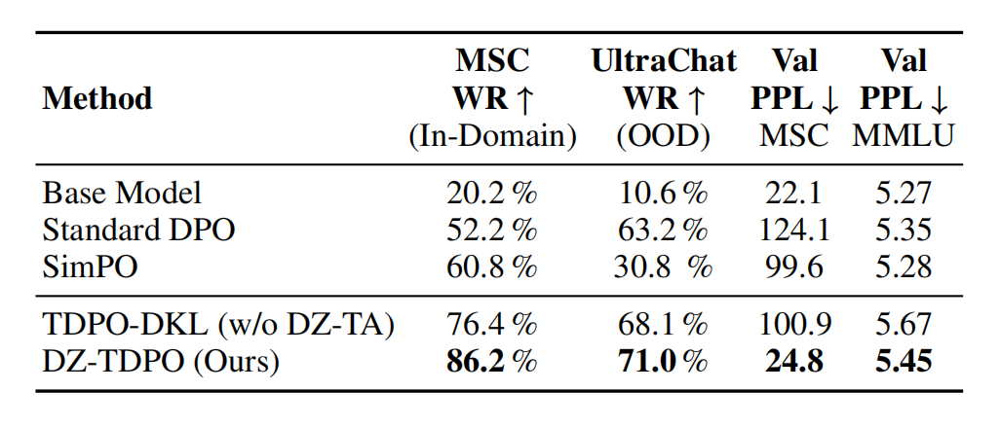

<div align="center">

# TAB-TDPO: Non-Destructive Temporal Alignment for Mutable State Tracking in Long-Context Dialogue

<a href="TAB_TDPO_Paper.pdf"></a>
<a href="https://twitter.com/YourTwitterHandle"></a>
<a href="#"></a>

**Yijun Liao**  
*Independent Researcher*

[**Read the Paper (PDF)**](TAB_TDPO_Paper.pdf) | [**Twitter Thread**](https://x.com/KitaLiao)

</div>

---

## 📢 News
- **[2025/12/12]** 🚀 **Paper Released!** We have uploaded the paper PDF directly to this repo while waiting for ArXiv endorsement.
- **[Coming Soon]** 💻 **Code Release:** The full training and evaluation scripts (including the MSC dataset processing pipeline) are being cleaned up and will be released **within this week**.

---

## ⚡️ Abstract

In long-context dialogue systems, models suffer from **State Inertia**, where static constraints prevent resolving conflicts between evolving user intents (e.g., "I'm now Vegan") and established historical context. Standard alignment methods like DPO incur a massive **"Alignment Tax"** (perplexity explosion >100) when trying to force these updates.

We propose **TAB-TDPO**, a non-destructive alignment framework that synergizes:
1.  **Conflict-Aware Dynamic KL Constraints (TDPO-DKL)**: Optimization level adjustment.
2.  **Learnable Temporal Attention Bias (Scalar TAB)**: Representation level filtering powered by semantic conflict detection.

**Result:** TAB-TDPO achieves **State-of-the-Art win rates (99.4% on Qwen2.5-7B)** on the Multi-Session Chat (MSC) dataset while maintaining robust zero-shot generalization and negligible perplexity overhead.

---

## 🌟 Key Results

### 1. SOTA Performance on Mutable State Tracking
TAB-TDPO significantly outperforms Standard DPO and SimPO on the MSC dataset, solving the "State Inertia" problem without destroying the model's general capabilities.

<div align="center">
  
</div>

| Method | Win Rate (MSC) | PPL (Validation) | Alignment Tax |
| :--- | :---: | :---: | :---: |
| **Base Model (Phi-3.5)** | 20.2% | 22.1 | - |
| **Standard DPO** | 52.2% | 124.1 💥 | High |
| **SimPO** | 60.8% | 99.6 | High |
| **TAB-TDPO (Ours)** | **86.2%** | **24.8** ✅ | **Negligible** |

> **Note:** On **Qwen2.5-7B**, TAB-TDPO achieves a near-perfect **99.4% Win Rate**.

### 2. Robustness (Needle-in-a-Haystack)
Does the temporal decay make the model "forgetful"? **No.**
Our "Non-Conflicting Needle-in-a-Haystack" test confirms that TAB-TDPO retains 100% retrieval accuracy for non-conflicting facts, demonstrating precise attention regulation.

---

## 🛠️ Methodology

<div align="center">
  
</div>

TAB-TDPO introduces a **Conflict-Aware Adaptive Decay** mechanism.
*   **Scalar TAB:** We map dialogue turns into a latent semantic space using SBERT. A learnable scalar $\lambda$ applies a temporal bias *only* when a semantic conflict is detected between the current instruction and history.
*   **System Prompt Shielding:** We enforce a hard constraint to ensure the "System Prompt" (Safety Constitution) is never decayed, ensuring safety amidst aggressive state updates.

---

## 💻 Installation & Usage

*(Code is currently being finalized. The following structure will be available shortly.)*

```bash
git clone https://github.com/YourUsername/TAB-TDPO.git
cd TAB-TDPO
pip install -r requirements.txt


## Training
```python
# Example command for training on MSC
python train_tab_tdpo.py --model_name_or_path Microsoft/Phi-3.5-mini-instruct --output_dir ./checkpoints


## 📜 Citation
If you find this work helpful, please consider citing:
```latex
@misc{liao2025tabtdpo,
      title={TAB-TDPO: Non-Destructive Temporal Alignment for Mutable State Tracking in Long-Context Dialogue}, 
      author={Yijun Liao},
      year={2025},
      note={Under Review / Pre-print available at GitHub},
}

<div align="center">
This project is an independent research effort.
If you are an ArXiv endorser in cs.CL and find this work valuable, please consider endorsing. Thank you! 🙏
</div>
